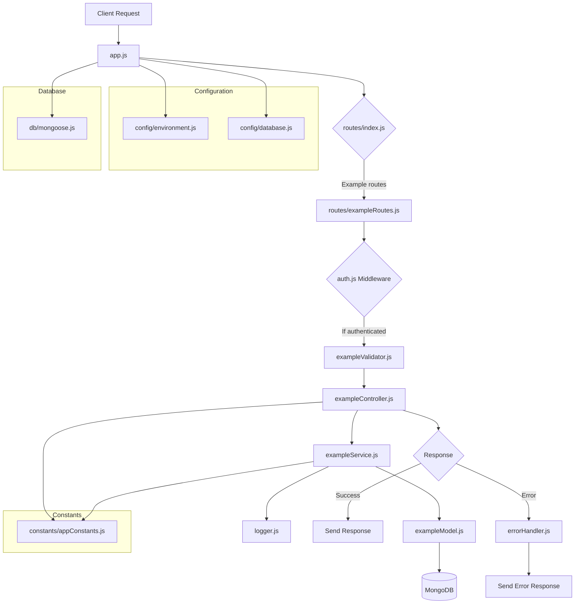

# Your Project Name

Brief description of your project.

## Application Flow

Below is a diagram illustrating the flow of our application:

This diagram shows how a request flows through our application, from the initial client request to the final response.

## Setup Instructions

(Your setup instructions here)

## Usage

(Your usage instructions here)